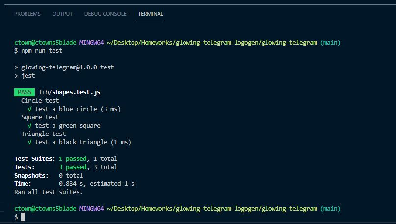
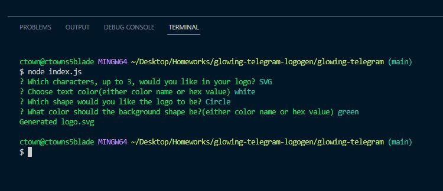
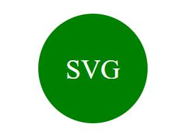

# glowing-telegram
This is an app that generates a logo.svg based on user input from the terminal.

  ## Table of Contents
  - [Description](#Description)
  - [Usage](#Usage)
  - [Installation](#Installation)
  - [License](#License)
  - [Contributing](#Contributing)
  - [Tests](#Tests)
  - [Questions](#Questions)

  ## Description
  This project generates simple logos in a circle, square or triangle shape with up to 3 characters in them in any specified colors.

  ## Usage
  To use this app, clone or download the code and open it in vscode. In a terminal type node index.js to start the app.

  ## Installation
  Clone or download the code and open it in vscode or other app that allows you to run node.js and has a terminal.

  ## Questions
   contact GitHub user ctowns5

  ## Contributing
  NA

  ## Tests
  there are 3 tests, 1 for each shape offered, to execute the tests type npm run test in the terminal from the project folder.

  ## Picture of testing
 
  ## Picture of app after running
 
  ## Picture of example logo
 

  ## License
  Licensed under the [MIT](https://opensource.org/licenses/MIT) license
  

  GitHub repository: https://github.com/ctowns5/glowing-telegram
  
  Walkthrough video: https://drive.google.com/file/d/1bHiG40Apkj7CfM9WR5L45V7d5JECsEm1/view

  